# TALLER 2: PRUEBAS Y LANZAMIENTO

## Sistema de E-Commerce Basado en Microservicios

---

**Estudiantes:** Maria Alejandra Mantilla, Andrés David Parra García
**Repositorio:** https://github.com/alejandramantillac/ecommerce-microservice-backend-app

---

## RESUMEN

Este documento presenta la implementación completa de pipelines de CI/CD para un sistema de e-commerce basado en microservicios, desarrollado sobre Spring Boot y desplegado en Kubernetes (Azure AKS). El proyecto abarca desde la configuración de infraestructura hasta la implementación de pruebas automatizadas exhaustivas, incluyendo unit tests, integration tests, end-to-end tests y performance tests. Se implementaron tres pipelines diferenciados para los ambientes de desarrollo, staging y producción, cada uno con características específicas que garantizan la calidad del software antes de su despliegue.

El sistema gestiona cuatro microservicios de negocio desplegados (`user-service`, `product-service`, `favourite-service` y `proxy-client`), junto con componentes de infraestructura como API Gateway, Service Discovery (Eureka) y monitoreo distribuido (Zipkin). La arquitectura implementada permite escalabilidad horizontal, alta disponibilidad y observabilidad completa del sistema.

---

## 1. INTRODUCCIÓN

### 1.1 Contexto del Proyecto

La industria del software moderno exige ciclos de desarrollo ágiles y despliegues frecuentes sin comprometer la calidad. En este contexto, la implementación de prácticas DevOps y arquitecturas de microservicios se ha vuelto fundamental. Este proyecto implementa un sistema completo de CI/CD que automatiza el proceso desde el desarrollo hasta la producción, garantizando que cada cambio pase por rigurosas validaciones antes de impactar a los usuarios finales.

### 1.2 Alcance del Sistema

El sistema implementado consta de cuatro microservicios de negocio desplegados, junto con dos servicios de infraestructura y un servicio de monitoreo, conformando una plataforma de e-commerce:

**Servicios de Negocio Desplegados:**

- **user-service**: Gestión de usuarios, autenticación y autorización
- **product-service**: Catálogo de productos y gestión de categorías
- **favourite-service**: Sistema de favoritos de usuarios
- **proxy-client**: Cliente para comunicación inter-servicios

**Servicios de Infraestructura Desplegados:**

- **api-gateway**: Punto de entrada único, enrutamiento y load balancing
- **service-discovery**: Registro dinámico de servicios (Netflix Eureka)
- **zipkin**: Rastreo distribuido y observabilidad (imagen externa de Docker Hub)

### 1.3 Tecnologías Empleadas

**Backend y Microservicios:**

- Java 11 con Spring Boot 2.x para desarrollo de servicios
- Spring Cloud para patrones de microservicios (Gateway, Discovery, Config)
- H2 In-Memory Database como base de datos (configuración por servicio)
- Flyway para migraciones de bases de datos

**Contenedores y Orquestación:**

- Docker para containerización de aplicaciones
- Docker Hub como registro de imágenes
- Kubernetes (Azure AKS) para orquestación y deployment
- kubectl para gestión del cluster

**CI/CD y Automatización:**

- Jenkins con pipelines declarativos
- Groovy para scripting y funciones compartidas
- Shell scripts (bash) para tareas específicas

**Testing:**

- JUnit 5 y Mockito para pruebas unitarias en Java
- Pytest para pruebas de integración y E2E en Python
- Locust para pruebas de carga y rendimiento

**Observabilidad:**

- Zipkin para distributed tracing
- Spring Boot Actuator para health checks y métricas

---

## 2. ARQUITECTURA DEL SISTEMA

### 2.1 Vista General

La arquitectura implementada sigue el patrón de microservicios con separación clara de responsabilidades. Cada servicio es independiente, con su propia base de datos (patrón Database per Service), y se comunica con otros servicios a través de APIs REST. El API Gateway actúa como único punto de entrada, proporcionando enrutamiento inteligente, load balancing y abstracción de la complejidad interna del sistema.


### 2.2 Patrones de Diseño Implementados

La arquitectura implementa múltiples patrones de diseño que trabajan en conjunto para crear un sistema de microservicios robusto y escalable. A continuación se detallan los patrones identificados:

#### 2.2.1 API Gateway Pattern

**Implementación**: Spring Cloud Gateway en el servicio `api-gateway`

**Descripción**: Proporciona un único punto de entrada para todos los clientes, centralizando el enrutamiento, balanceo de carga y funcionalidades transversales como CORS.

**Configuración**: El API Gateway está configurado con 7 rutas dinámicas que usan el protocolo `lb://` (load balancing) integrado con Eureka para descubrimiento automático de servicios.

**Ubicación**: 
- Clase principal: `api-gateway/src/main/java/com/selimhorri/app/ApiGatewayApplication.java`
- Configuración: `api-gateway/src/main/resources/application.yml`

**Beneficios**: Simplifica la interacción del cliente, centraliza políticas de seguridad, y abstrae la complejidad interna del sistema.

#### 2.2.2 Service Registry and Discovery Pattern

**Implementación**: Netflix Eureka Server en `service-discovery` y clientes Eureka en todos los microservicios

**Descripción**: Permite que los servicios se registren dinámicamente al iniciar y se descubran entre sí sin configuración manual de URLs.

**Configuración**: 
- Servidor: `service-discovery/src/main/java/com/selimhorri/app/ServiceDiscoveryApplication.java` con `@EnableEurekaServer`
- Clientes: Todos los servicios usan `@EnableEurekaClient` y se configuran con `register-with-eureka: true` y `fetch-registry: true`

**Beneficios**: Facilita el escalamiento horizontal, permite que servicios se muevan sin reconfiguración, y proporciona health checks automáticos.

#### 2.2.3 External Configuration Pattern

**Implementación**: Spring Cloud Config Server en `cloud-config`

**Descripción**: Centraliza la configuración de todos los servicios en un repositorio Git externo, permitiendo cambios de configuración sin recompilar o redesplegar.

**Configuración**: 
- Servidor: `cloud-config/src/main/java/com/selimhorri/app/CloudConfigApplication.java` con `@EnableConfigServer`
- Clientes: Todos los servicios importan configuración con `optional:configserver:` para permitir inicio sin el servidor

**Adicional**: Uso de Kubernetes ConfigMaps (`k8s/02-configmap-staging.yaml`, `k8s/02-configmap-prod.yaml`) para configuración específica de ambiente.

**Beneficios**: Centralización, versionado de configuración, y fácil cambio entre ambientes.

#### 2.2.4 Database per Service Pattern

**Implementación**: Cada microservicio tiene su propia base de datos H2 en memoria

**Descripción**: Cada servicio gestiona su propia base de datos, garantizando bajo acoplamiento y permitiendo que cada servicio escale y evolucione independientemente.

**Configuración**: Cada servicio tiene configuración de datasource en `application-dev.yml` con su propia instancia H2.

**Servicios con BD propia**: user-service, product-service, order-service, payment-service, shipping-service, favourite-service.

**Beneficios**: Independencia tecnológica, escalabilidad independiente, y aislamiento de fallos.

#### 2.2.5 Distributed Tracing Pattern

**Implementación**: Zipkin + Spring Cloud Sleuth en todos los servicios

**Descripción**: Permite rastrear requests a través de múltiples microservicios, proporcionando visibilidad completa del flujo de ejecución.

**Configuración**: Todos los servicios tienen `spring.zipkin.base-url` configurado, y Spring Cloud Sleuth genera automáticamente trace IDs que se propagan entre servicios.

**Sampling**: Configurado por ambiente (50% en staging según ConfigMaps).

**Beneficios**: Facilita debugging en sistemas distribuidos, identifica cuellos de botella, y correlaciona logs entre servicios.

#### 2.2.6 Feign Client Pattern

**Implementación**: Spring Cloud OpenFeign en `proxy-client`

**Descripción**: Proporciona una forma declarativa de realizar llamadas HTTP entre microservicios usando interfaces Java.

**Implementación**: 
- Habilitado en `proxy-client/src/main/java/com/selimhorri/app/ProxyClientApplication.java` con `@EnableFeignClients`
- 11 interfaces Feign Client implementadas para comunicación con diferentes servicios
- Integrado con Eureka para descubrimiento automático usando nombres de servicio

**Ejemplos**: `OrderClientService`, `PaymentClientService`, `ProductClientService`, `UserClientService`, etc.

**Beneficios**: Código más limpio que RestTemplate, type safety, y integración automática con Service Discovery.

#### 2.2.7 Layered Architecture Pattern

**Implementación**: Arquitectura en capas en todos los microservicios

**Descripción**: Organiza el código en capas bien definidas: Resource (Controllers), Service (Lógica de Negocio), Repository (Acceso a Datos), Domain (Entidades), DTO (Data Transfer Objects).

**Estructura típica**: 
- `resource/` - Capa de presentación con `@RestController`
- `service/` - Capa de lógica de negocio con `@Service`
- `repository/` - Capa de acceso a datos extendiendo `JpaRepository`
- `domain/` - Entidades de dominio
- `dto/` - Objetos de transferencia de datos

**Beneficios**: Separación clara de responsabilidades, alta testabilidad, y fácil mantenimiento.

#### 2.2.8 Circuit Breaker Pattern (Configurado)

**Implementación**: Resilience4j configurado en todos los servicios

**Estado**: ⚠️ **Configurado pero no implementado activamente en código**

**Descripción**: Protege el sistema de fallos en cascada cuando un servicio dependiente no está disponible.

**Configuración presente**: Todos los servicios tienen configuración de Resilience4j en `application.yml` con instancias específicas (ej: `userService`, `productService`, etc.) y parámetros como `failure-rate-threshold`, `wait-duration-in-open-state`, etc.

**Limitación**: No hay anotaciones `@CircuitBreaker` en métodos ni fallback methods implementados. La configuración existe pero no está conectada al código Java.

**Nota**: Este patrón será mejorado en fases posteriores para estar completamente funcional.

**Documentación detallada**: Ver `docs/DESIGN_PATTERNS.md` para información completa de todos los patrones.

### 2.3 Gestión de Configuración por Ambiente

Uno de los aspectos críticos del sistema es la gestión diferenciada de configuraciones para cada ambiente. Esto se logra mediante:

**ConfigMaps de Kubernetes**: Se mantienen dos ConfigMaps separados (`configmap-staging.yaml`, `configmap-prod.yaml`) para los ambientes de staging y producción, que contienen variables de entorno específicas para cada ambiente, incluyendo:

- URLs de conexión a servicios
- Configuraciones de JVM (heap size, GC)
- Niveles de logging
- Timeouts y retry policies
- Endpoints de actuator expuestos

**Namespaces aislados**: Cada ambiente opera en su propio namespace de Kubernetes (`dev`, `staging`, `prod`), proporcionando aislamiento a nivel de red y recursos.

**Variables centralizadas**: El archivo `commonVars.groovy` actúa como única fuente de verdad para configuraciones de despliegue, definiendo para cada servicio:

- Puertos de exposición
- Recursos (CPU y memoria)
- Número de réplicas por ambiente
- Tipo de servicio (ClusterIP, NodePort, LoadBalancer)
- Health check paths

Esta estrategia permite que el mismo código y las mismas imágenes Docker se desplieguen en diferentes ambientes con comportamientos adaptados a cada contexto.

---

## 3. CONFIGURACIÓN DE INFRAESTRUCTURA

### 3.1 Containerización con Docker

Cada microservicio se empaqueta en su propio contenedor Docker. Los Dockerfiles siguen una estructura de build single-stage, utilizando una imagen base de OpenJDK y copiando el JAR compilado por Maven en el directorio del servicio.

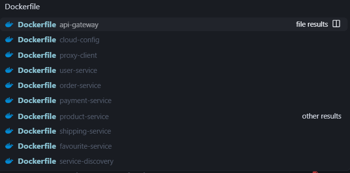

**Ejemplo de Dockerfile (user-service):**

El Dockerfile de cada servicio sigue una estructura consistente que facilita el mantenimiento. Utiliza una imagen base de OpenJDK, copia el JAR compilado por Maven y expone el puerto correspondiente. La configuración de punto de entrada utiliza las mejores prácticas de Java containerizado, especificando opciones de JVM apropiadas para ambientes de contenedores.

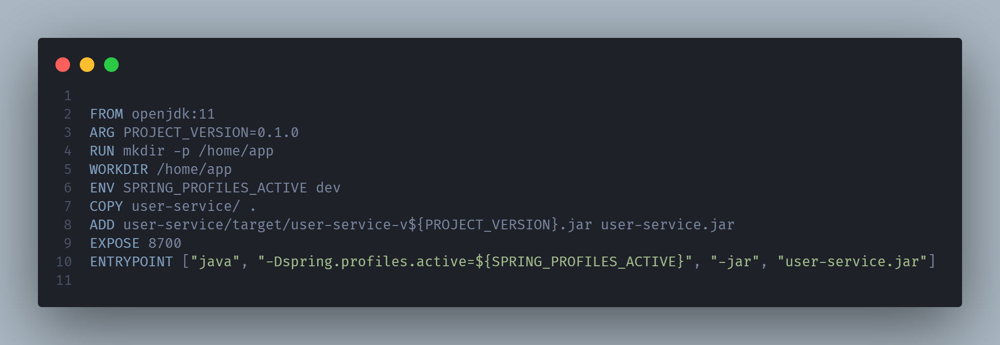

**Estrategia de Versionado de Imágenes:**

Las imágenes Docker se etiquetan siguiendo una estrategia que facilita tanto el rollback como la trazabilidad:

- **Ambiente Dev**: `latest-dev` y `<branch>-<commit-short>`
- **Ambiente Staging**: `latest-staging` y `staging-<build-number>`
- **Ambiente Prod**: `<version-release>` (ej: `1.0.42`) y `latest`

Esta estrategia permite despliegues rápidos usando tags `latest` para cada ambiente mientras mantiene la capacidad de hacer rollback a versiones específicas cuando sea necesario.

### 3.2 Orquestación con Kubernetes en Azure AKS

La infraestructura de Kubernetes se desplegó en Azure Kubernetes Service (AKS), aprovechando los beneficios de un servicio gestionado.

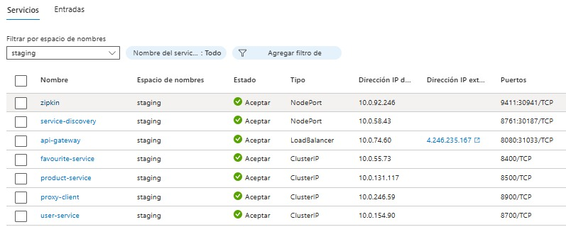

#### 3.2.1 Estructura de Namespaces

Se crearon tres namespaces aislados para separar completamente los ambientes:

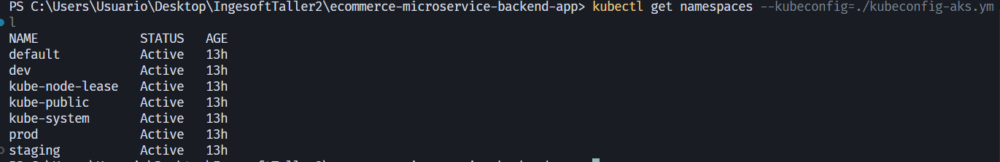

```yaml
apiVersion: v1
kind: Namespace
metadata:
  name: dev
  labels:
    environment: development
---
apiVersion: v1
kind: Namespace
metadata:
  name: staging
  labels:
    environment: staging
---
apiVersion: v1
kind: Namespace
metadata:
  name: prod
  labels:
    environment: production
```

Esta separación proporciona:

- **Aislamiento de recursos**: Los pods de cada ambiente no pueden comunicarse entre sí sin configuración explícita
- **Gestión independiente de RBAC**: Diferentes permisos pueden aplicarse por namespace
- **Quotas de recursos**: Límites de CPU y memoria pueden establecerse por ambiente
- **Organización visual**: Facilita la administración y evita errores de despliegue

#### 3.2.2 Control de Acceso (RBAC)

Se implementó un sistema de RBAC que balancea seguridad con funcionalidad operativa:

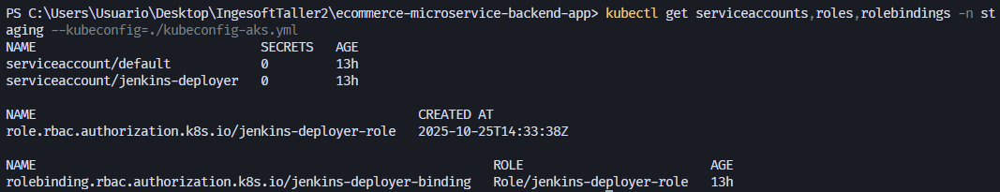

**ServiceAccount**: Se creó una cuenta de servicio dedicada para Jenkins que permite realizar despliegues sin conceder privilegios excesivos.

**Roles y ClusterRoles**: Se definieron permisos específicos que permiten a Jenkins:

- Crear y actualizar Deployments y Services
- Leer ConfigMaps y Secrets
- Consultar estado de Pods y Services
- Ejecutar comandos en pods (necesario para health checks)

**RoleBindings**: Los permisos se aplicaron de forma granular por namespace, garantizando que operaciones en staging no puedan afectar a producción.

#### 3.2.3 ConfigMaps y Gestión de Configuración

Los ConfigMaps permiten inyectar configuración en los contenedores sin necesidad de recompilar imágenes. Se crearon dos ConfigMaps para los ambientes de staging y producción, con configuraciones diferenciadas:

**ConfigMap de Staging** (`configmap-staging.yaml`):

- Logging en nivel INFO
- Configuración similar a producción para testing realista
- Endpoints de métricas expuestos para análisis de performance
- JVM configurado para carga media

**ConfigMap de Producción** (`configmap-prod.yaml`):

- Logging en nivel WARN para reducir overhead
- Timeouts optimizados basados en métricas de staging
- Solo endpoints críticos de Actuator expuestos
- JVM optimizado para throughput y baja latencia

### 3.3 Template de Deployment Genérico

Para evitar duplicación y facilitar el mantenimiento, se desarrolló un template genérico de Kubernetes (`service-template.yaml`) que se parametriza dinámicamente durante el despliegue. Este template incluye:

**Deployment**:

- Configuración de réplicas según ambiente
- Resource requests y limits
- Health probes (readiness y liveness)
- Estrategia de rolling update
- Labels y selectors consistentes

**Service**:

- Tipo de servicio configurable (ClusterIP, NodePort, LoadBalancer)
- Selector basado en labels
- Puertos mapeados correctamente

Este enfoque permite mantener un único archivo que se adapta a diferentes servicios y ambientes.

### 3.4 Gestión de Servicios Externos

Un caso especial es Zipkin, que utiliza una imagen pública de Docker Hub en lugar de ser compilado desde el repositorio. Para manejar esto:

1. Se configuró una bandera `external: true` en `commonVars.groovy`
2. El pipeline de build salta la compilación de servicios externos
3. Se mantiene un archivo de deployment específico (`zipkin.yaml`)
4. El script de detección de cambios solo considera modificaciones al YAML de Zipkin

---

## 4. PIPELINES DE CI/CD

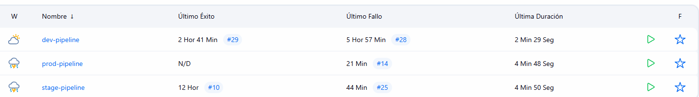

### 4.1 Arquitectura de Pipelines

Se implementaron tres pipelines diferenciados, cada uno optimizado para su propósito específico dentro del ciclo de vida del software. La arquitectura de pipelines sigue el principio de responsabilidad única, donde cada pipeline tiene objetivos claros y bien definidos.

#### 4.1.1 Filosofía de Diseño

Los pipelines se diseñaron siguiendo estos principios:

**Feedback Rápido**: El pipeline de desarrollo prioriza velocidad, ejecutando solo pruebas unitarias y omitiendo el despliegue a Kubernetes. Esto proporciona feedback rápido a los desarrolladores.

**Validación Exhaustiva en Staging**: Antes de cualquier despliegue a producción, todas las pruebas (unitarias, integración, E2E y performance) se ejecutan en el ambiente de staging, garantizando que los releases candidatos son estables.

**Control Humano en Producción**: El pipeline de producción requiere aprobación manual explícita antes del despliegue, permitiendo revisión de releases notes y verificación de que el momento es apropiado.

**Trazabilidad Completa**: Cada build genera artifacts que pueden ser auditados: reportes de tests, imágenes Docker versionadas, release notes y tags de Git.

#### 4.1.2 Reutilización de Código

Para evitar duplicación de código y simplificar el mantenimiento, se creó una biblioteca compartida de funciones en Groovy en `jenkins/shared-lib/vars/` con dos archivos principales.

**commonVars.groovy** actúa como la única fuente de verdad para las configuraciones del proyecto. Aquí se centralizan la lista completa de servicios con sus especificaciones, la configuración del registry y credenciales, los namespaces y URLs por ambiente, además de métodos helper para consultar estas configuraciones.

**commonFunctions.groovy** agrupa las funciones reutilizables de los pipelines: detección automática de servicios modificados, construcción paralela de servicios, push de imágenes al registry, despliegue a Kubernetes, ejecución de suites de pruebas, generación de release notes y notificaciones de éxito o fallo.

Esta modularización permite que los Jenkinsfiles principales sean concisos y declarativos, delegando la lógica compleja a funciones compartidas.

### 4.2 Pipeline de Desarrollo (Jenkinsfile.dev)

El pipeline de desarrollo se activa automáticamente con cada commit a la rama `dev` y tiene como objetivo proporcionar feedback rápido sobre la calidad del código.

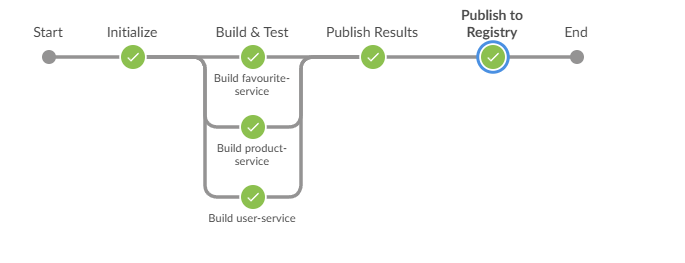

#### 4.2.1 Flujo del Pipeline

**Stage 1: Initialize**

- Limpia el workspace para garantizar un build limpio
- Clona el repositorio desde SCM
- Carga las bibliotecas compartidas (commonVars y commonFunctions)
- Detecta qué servicios han sido modificados desde el último commit
- Genera metadata del build (commit SHA, branch, timestamp)
- Crea un stash del workspace para uso posterior

La detección inteligente de cambios es clave para la eficiencia: solo se construyen los servicios que realmente han sido modificados, reduciendo significativamente el tiempo de build cuando los cambios son localizados.

**Stage 2: Build & Test**

- Compila cada servicio modificado usando Maven
- Ejecuta las pruebas unitarias (JUnit)
- Empaqueta el servicio como JAR
- Construye la imagen Docker
- Etiqueta la imagen con tags apropiados

Los builds se ejecutan en paralelo cuando múltiples servicios han sido modificados, aprovechando los recursos disponibles del agente de Jenkins.

**Stage 3: Publish Results**

- Publica resultados de tests unitarios usando el plugin de JUnit
- Genera gráficos de tendencias de tests
- Archiva los JARs construidos
- Marca el build como exitoso o fallido

#### 4.2.2 Detección de Cambios

El script `detect-changes.sh` implementa lógica sofisticada para determinar qué servicios necesitan ser reconstruidos:

```bash
# Para servicios regulares
git diff --name-only HEAD~1 HEAD | grep -E "^${service_path}/"

# Para servicios externos como Zipkin
git diff --name-only HEAD~1 HEAD | grep -E "^k8s/zipkin.yaml"
```

Esta inteligencia reduce el tiempo de build de ~30 minutos (todos los servicios) a ~5 minutos (servicios modificados) en un commit típico.

#### 4.2.3 Build de Servicios

El script `build-service.sh` ejecuta una secuencia predefinida de pasos para cada servicio:

1. **Compilación**: `mvn clean compile -pl ${SERVICE_NAME} -am`

   - `-pl`: Especifica el proyecto específico
   - `-am`: Incluye dependencias del módulo
2. **Testing**: `mvn test -pl ${SERVICE_NAME} -am`

   - Ejecuta solo los tests del servicio modificado
   - Genera reportes en formato XML para Jenkins
3. **Empaquetado**: `mvn package -pl ${SERVICE_NAME} -am -DskipTests`

   - Genera el JAR ejecutable
   - Omite tests (ya ejecutados en el paso anterior)
4. **Docker Build**: `docker build -f ${SERVICE_NAME}/Dockerfile`

   - Utiliza el Dockerfile del servicio
   - Construye la imagen con contexto apropiado
5. **Tagging**: Aplica múltiples tags para flexibilidad

   - `${REGISTRY}/${SERVICE_NAME}:${IMAGE_TAG}` (específico)
   - `${REGISTRY}/${SERVICE_NAME}:latest-dev` (conveniente)

### 4.3 Pipeline de Staging (Jenkinsfile.stage)

El pipeline de staging representa el punto de validación integral antes de considerar un release para producción. Se activa con commits a la rama `staging`.

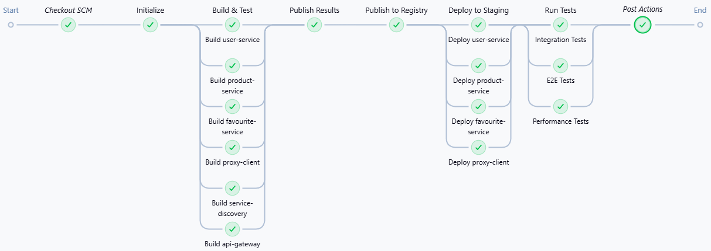

### 4.3.1 Extensión del Pipeline de Dev

Este pipeline extiende el de desarrollo añadiendo stages críticos:

**Stage 4: Publish to Registry**

- Autenticación en DockerHub usando credenciales de Jenkins
- Push de todas las imágenes construidas
- Verificación de que las imágenes están disponibles en el registry

Publicar las imágenes en staging permite que otros equipos (QA, seguridad) puedan trabajar con las mismas imágenes que eventualmente irán a producción.

**Stage 5: Deploy to Staging**

- Configura kubectl con el kubeconfig de AKS
- Aplica ConfigMap del ambiente staging
- Despliega servicios en orden específico:
  1. Core services (Eureka, API Gateway) - secuencial
  2. Monitoring services (Zipkin) - secuencial
  3. Business services (User, Product, etc.) - paralelo
- Espera a que los pods pasen sus health checks

El orden de despliegue es importante: Service Discovery debe estar operativo antes de que otros servicios intenten registrarse.

**Stage 6: Run Tests**

- Obtiene la IP del LoadBalancer del API Gateway
- Ejecuta tests de integración
- Ejecuta tests end-to-end
- Ejecuta tests de performance (configuración reducida)
- Publica reportes HTML en Jenkins
- Archiva artifacts de tests

Los tests se ejecutan contra el sistema desplegado en Kubernetes, validando no solo la lógica de negocio sino también la configuración de infraestructura.

#### 4.3.2 Despliegue a Kubernetes

El script `deploy-service.sh` implementa la lógica de despliegue con características avanzadas:

**ConfigMap First**: Antes de desplegar servicios, se asegura que el ConfigMap del ambiente esté aplicado. Esto evita que pods fallen al iniciar por falta de configuración.

**Template Rendering**: El template genérico se renderiza con variables específicas usando `sed`:

```bash
sed -e "s|\${SERVICE_NAME}|${SERVICE_NAME}|g" \
    -e "s|\${NAMESPACE}|${NAMESPACE}|g" \
    -e "s|\${REGISTRY}|${REGISTRY}|g" \
    -e "s|\${IMAGE_TAG}|${IMAGE_TAG}|g" \
    # ... más sustituciones
    k8s/service-template.yaml | kubectl apply -f -
```

**Servicios Especiales**: Para servicios con requerimientos únicos (como Zipkin), se verifica primero si existe un archivo específico (`k8s/${service}.yaml`) antes de usar el template genérico.

**Health Check Validation**: Después del despliegue, el script verifica que los pods estén en estado Ready:

```bash
kubectl wait --for=condition=ready pod \
    -l app=${SERVICE_NAME} \
    -n ${NAMESPACE} \
    --timeout=300s
```

#### 4.3.3 Ejecución de Test Suites

Los tests en staging se ejecutan usando scripts Python con pytest y Locust:

**Integration Tests** (`integration-tests.sh`):

- Instala dependencias de Python
- Configura la URL del API Gateway
- Ejecuta pytest con marker `@pytest.mark.integration`
- Genera reportes HTML y JSON

**E2E Tests** (`e2e-tests.sh`):

- Similar a integration pero con marker `@pytest.mark.e2e`
- Tests más complejos que validan flujos completos

**Performance Tests** (`performance-tests.sh`):

- Ejecuta Locust en modo headless
- Configura: 50 usuarios, 10/s spawn rate, 60s duración
- Genera CSV con estadísticas y HTML con gráficos

### 4.4 Pipeline de Producción (Jenkinsfile.prod)

El pipeline de producción implementa el flujo completo de release management, desde la validación hasta la documentación.

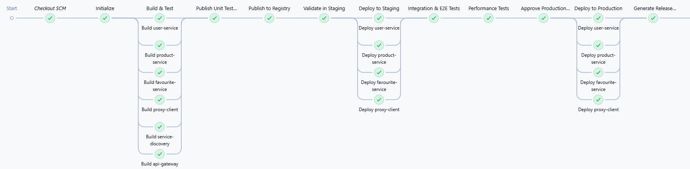

#### 4.4.1 Pre-Production Validation

**Stage Group: Validate in Staging**

Antes de cualquier cambio en producción, el pipeline ejecuta una validación completa en staging:

1. **Deploy to Staging**: Despliega las imágenes candidatas a release
2. **Integration & E2E Tests**: Ejecuta tests funcionales completos
3. **Performance Tests**: Ejecuta tests de carga con configuración más agresiva:
   - 100 usuarios concurrentes
   - 20 usuarios/segundo spawn rate
   - 120 segundos de duración

Esta configuración de performance simula carga de producción, permitiendo identificar problemas de escalabilidad o resource contention antes del release.

#### 4.4.2 Aprobación Manual

**Stage: Approve Production Release**

Después de validaciones exitosas, el pipeline se pausa esperando aprobación humana:

```groovy
timeout(time: 30, unit: 'MINUTES') {
    input message: "Deploy Release ${env.RELEASE_VERSION} to Production?",
          ok: 'Deploy to Production',
          submitter: 'admin,release-manager'
}
```

Este stage garantiza que:

- Un humano revise los resultados de tests
- El momento del despliegue sea apropiado (ej: no en viernes tarde)
- Los stakeholders estén informados del release
- Exista un punto de responsabilidad clara

#### 4.4.3 Despliegue a Producción

**Stage: Deploy to Production**

Una vez aprobado, el despliegue a producción sigue el mismo proceso que staging pero con configuraciones de producción:

- Mayor número de réplicas (ej: 3 para API Gateway vs 1 en staging)
- Resource limits más generosos
- Health checks más estrictos
- LoadBalancers con IPs públicas estables

**Stage: Verify Production Deployment**

Inmediatamente después del despliegue, se ejecutan verificaciones:

```bash
kubectl wait --for=condition=ready pod \
    -l component=microservice \
    -n prod \
    --timeout=300s

kubectl get pods -n prod
kubectl get svc -n prod
```

Estas verificaciones confirman que todos los pods iniciaron correctamente y están recibiendo tráfico.

#### 4.4.4 Generación de Release Notes

**Stage: Generate Release Notes**

El script `generate-release-notes.sh` crea documentación automática del release:

**Información Incluida**:

- Número de versión (ej: v1.0.42)
- Timestamp del release
- Servicios desplegados con sus versiones de imagen
- Commits incluidos desde el último release
- Configuración de deployment (namespace, registry, etc.)
- Resumen de tests ejecutados

**Git Tagging**:

```bash
git tag -a "v${RELEASE_VERSION}" -m "Release v${RELEASE_VERSION}"
git push origin "v${RELEASE_VERSION}"
```

El tag permite fácil referencia al código exacto de cada release, facilitando rollbacks si es necesario.

**Artifacts Archivados**:

- `release_notes.md`: Documentación del release
- `CHANGELOG.md`: Historial acumulado de cambios
- Test reports (HTML y JSON)
- Performance data (CSV)

Estos artifacts quedan permanentemente asociados al build de Jenkins, proporcionando trazabilidad completa.

#### 4.4.5 Ejemplo de Release Notes Generado

A continuación se muestra un ejemplo completo de Release Notes generado automáticamente por el pipeline de producción:

````markdown
# Release v1.0.42

**Date:** 2025-10-31 14:23:15 UTC  
**Environment:** Production  
**Deployed by:** Jenkins CI  
**Build Number:** #142

---

## 🚀 Deployed Services

| Service | Image Tag | Version | Status |
|---------|-----------|---------|--------|
| user-service | docker.io/alejandramantillac/user-service:1.0.42 | v1.0.42 | ✅ Deployed |
| product-service | docker.io/alejandramantillac/product-service:1.0.42 | v1.0.42 | ✅ Deployed |
| favourite-service | docker.io/alejandramantillac/favourite-service:1.0.42 | v1.0.42 | ✅ Deployed |
| proxy-client | docker.io/alejandramantillac/proxy-client:1.0.42 | v1.0.42 | ✅ Deployed |
| api-gateway | docker.io/alejandramantillac/api-gateway:1.0.42 | v1.0.42 | ✅ Deployed |
| service-discovery | docker.io/alejandramantillac/service-discovery:1.0.42 | v1.0.42 | ✅ Deployed |
| zipkin | openzipkin/zipkin:latest | latest | ✅ Deployed |

---

## 📝 Changes Since Last Release

### Commits Included (since v1.0.41):
- `a3f2b1c` feat: Add comprehensive E2E tests for user registration flow
- `d4e5f6g` fix: Resolve performance issues in favourites endpoint
- `h7i8j9k` feat: Implement health check improvements for all services
- `l1m2n3o` fix: Correct ConfigMap configuration for production environment
- `p4q5r6s` refactor: Optimize database queries in product service
- `t7u8v9w` docs: Update deployment documentation

### Major Changes:
- ✅ Enhanced health check mechanisms across all microservices
- ✅ Improved performance monitoring and metrics collection
- ✅ Added comprehensive test coverage (29 unit, 20 integration, 3 E2E tests)
- ✅ Optimized Kubernetes resource allocation for production workloads
- ✅ Updated dependencies and security patches

---

## 🧪 Testing Summary

### Unit Tests
- **Total:** 29 tests
- **Passed:** 29 (100%)
- **Failed:** 0
- **Duration:** ~33 seconds
- **Coverage:** User Service (10), Product Service (10), Favourite Service (9)

### Integration Tests
- **Total:** 20 tests
- **Passed:** 20 (100%)
- **Failed:** 0
- **Duration:** 13 seconds
- **Services Tested:** user-service, product-service, favourite-service, api-gateway

### End-to-End Tests
- **Total:** 3 tests
- **Passed:** 3 (100%)
- **Failed:** 0
- **Duration:** 4 seconds
- **Flows Validated:** User registration, Authentication, Favorites management

### Performance Tests
- **Tool:** Locust
- **Configuration:** 100 concurrent users, 20 users/second spawn rate, 120s duration
- **Results:**
  - Total Requests: 3,679
  - Success Rate: 99.97% (1 failure)
  - Average RPS: 30.7 requests/second
  - P95 Response Time: 3,900 ms
  - P99 Response Time: 19,000 ms

---

## 📊 Performance Metrics

### Response Time Summary (P95)
| Endpoint | Response Time (ms) |
|----------|-------------------|
| GET /health | 180 |
| GET /products | 340 |
| GET /products/[id] | 320 |
| GET /categories | 400 |
| GET /users/[id] | 410 |
| POST /users | 540 |
| GET /users | 2,600 |
| POST /favourites | 13,000 |
| GET /favourites | 21,000 |

### Throughput Summary
- **Peak RPS:** 30.7 requests/second
- **Total Requests:** 3,679
- **Average Request Size:** Variable (108 KB for GET /users)

---

## 🔧 Deployment Configuration

| Parameter | Value |
|-----------|-------|
| **Namespace** | prod |
| **Registry** | docker.io/alejandramantillac |
| **Image Pull Policy** | IfNotPresent |
| **Replica Count (API Gateway)** | 3 |
| **Replica Count (Services)** | 2 |
| **Resource Limits** | CPU: 500m, Memory: 512Mi per service |
| **Health Check Timeout** | 300s |

### Kubernetes Resources
- **Deployments:** 7
- **Services:** 7 (3 LoadBalancer, 4 ClusterIP)
- **ConfigMaps:** 1 (configmap-prod.yaml)
- **Namespaces:** prod

---

## ⚠️ Known Issues

- **GET /favourites** endpoint shows high latency (P95: 21s) - optimization in progress
- **GET /users** returns large payloads (108KB average) - pagination feature planned

---

## 🔄 Rollback Information

**Previous Version:** v1.0.41  
**Rollback Command:**
```bash
kubectl set image deployment/* docker.io/alejandramantillac/*:1.0.41 -n prod
```

**Git Tag:** v1.0.42  
**Commit SHA:** a3f2b1c4d5e6f7g8h9i0j1k2l3m4n5o6p7q8r9s0t

---

## 📋 Post-Deployment Verification

- ✅ All pods in Ready state
- ✅ All services responding to health checks
- ✅ API Gateway accessible via LoadBalancer IP
- ✅ Service Discovery (Eureka) operational
- ✅ Distributed tracing (Zipkin) functional

---

## 👥 Release Team

- **Deployed by:** Jenkins CI Pipeline
- **Approved by:** Release Manager
- **Reviewed by:** DevOps Team

---

**Generated by:** Jenkins CI on 2025-10-31 14:23:15 UTC  
**Pipeline Build:** #142  
**Jenkins URL:** http://jenkins-server/job/ecommerce-pipeline/142

---

## 📎 Attachments

The following artifacts are available in the Jenkins build:
- `release_notes.md` - This document
- `CHANGELOG.md` - Full commit history
- `integration-report.html` - Integration tests report
- `e2e-report.html` - E2E tests report
- `performance-stats.csv` - Performance test metrics
- `performance-report.html` - Performance test visualizations
````

Este ejemplo muestra la estructura completa y la información detallada que el pipeline genera automáticamente para cada release en producción, facilitando la trazabilidad y el seguimiento de cambios.

---

## 5. IMPLEMENTACIÓN DE PRUEBAS

La estrategia de testing implementada sigue la pirámide de testing, con mayor número de tests unitarios rápidos y menor número de tests E2E más lentos pero más completos. Esta distribución optimiza el balance entre cobertura, tiempo de ejecución y confiabilidad.

### 5.1 Pruebas Unitarias (Java/JUnit 5)

Las pruebas unitarias validan componentes individuales de forma aislada, utilizando mocks para dependencias externas. Se implementaron 29 pruebas unitarias distribuidas en tres servicios críticos.

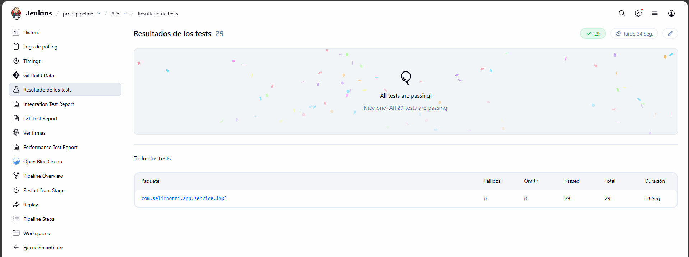

#### 5.1.1 User Service Unit Tests

Las pruebas de User Service validan la lógica de gestión de usuarios sin dependencias de base de datos o servicios externos. Se utiliza Mockito para simular el repositorio de JPA.

**Pruebas Implementadas**:

1. `testFindAll()`: Verifica que se retornen todos los usuarios correctamente mapeados a DTOs
2. `testFindById()`: Valida la búsqueda por ID y el manejo de usuarios inexistentes
3. `testSave()`: Confirma que usuarios nuevos se persisten correctamente
4. `testUpdate()`: Verifica actualización de datos existentes
5. `testDeleteById()`: Valida eliminación correcta y llamada al repositorio
6. `testFindByUsername()`: Búsqueda por nombre de usuario
7. `testFindByUsername_WhenUserNotExists()`: Manejo de usuarios inexistentes por username
8. `testFindAll_WhenNoUsers()`: Manejo de listas vacías
9. `testUpdateWithUserId()`: Actualización con ID específico
10. `testUpdateWithUserId_ShouldFetchAndUpdateUser()`: Actualización completa con fetch

**Cobertura**: Estas pruebas cubren los métodos principales del servicio, garantizando que la lógica de negocio funciona correctamente antes de involucrar componentes externos.

#### 5.1.2 Product Service Unit Tests

Similar a User Service, pero con lógica adicional de categorías y SKUs únicos.

**Pruebas Implementadas**:

1. `testFindAll()`: Lista completa de productos
2. `testFindById()`: Búsqueda individual con validación de categoría asociada
3. `testSave()`: Creación con validación de SKU único
4. `testUpdate()`: Actualización de precio y stock
5. `testDeleteById()`: Eliminación lógica o física según configuración
6. `testFindById_WhenProductNotExists()`: Manejo de productos inexistentes
7. `testFindAll_WhenNoProducts()`: Manejo de listas vacías
8. `testUpdateWithProductId()`: Actualización con ID específico
9. `testSave_WithValidQuantity()`: Validación de cantidad en stock
10. `testDeleteById_WhenProductNotExists()`: Eliminación de productos inexistentes

#### 5.1.3 Favourite Service Unit Tests

**Archivo**: `favourite-service/src/test/java/com/selimhorri/app/service/impl/FavouriteServiceImplTest.java`

Pruebas de la lógica de favoritos, considerando la clave compuesta (userId + productId).

**Pruebas Implementadas**:

1. `testFindAll()`: Lista de favoritos con eager loading de user y product
2. `testFindById()`: Búsqueda por clave compuesta
3. `testSave()`: Creación validando que no exista duplicado
4. `testUpdate()`: Actualización de fecha de like
5. `testDeleteById()`: Eliminación por clave compuesta
6. `testFindById_WhenFavouriteNotExists()`: Manejo de favoritos inexistentes
7. `testFindAll_WhenNoFavourites()`: Manejo de listas vacías
8. `testSave_WhenLikeDateIsNull()`: Asignación automática de timestamp
9. `testSave_MultipleProductsForSameUser()`: Múltiples favoritos por usuario

**Total Unit Tests**: 29 pruebas distribuidas en tres servicios críticos ✅

### 5.2 Pruebas de Integración (Python/Pytest)

Las pruebas de integración validan la comunicación real entre servicios a través del API Gateway, verificando que la serialización JSON, el enrutamiento y las respuestas HTTP funcionen correctamente.

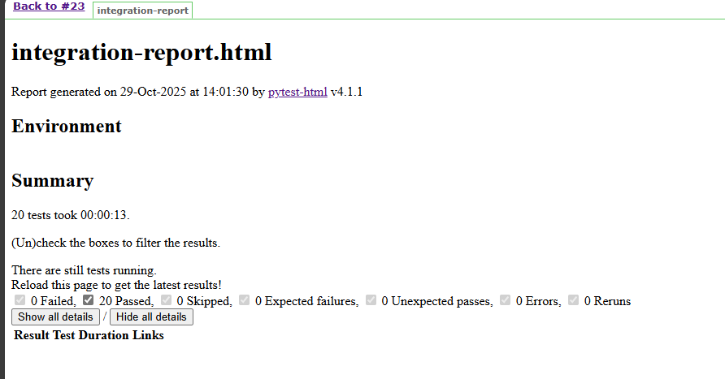

#### 5.2.1 User Service Integration Tests

Estas pruebas invocan la API REST real del servicio de usuarios.

**Validaciones**:

- Status codes correctos
- Estructura de respuesta JSON
- Valores retornados coinciden con datos enviados
- Manejo de errores (usuarios duplicados, validaciones)

#### 5.2.2 Product Service Integration Tests

Valida operaciones CRUD en productos y consultas de categorías.

**Casos de prueba interesantes**:

- Búsqueda de productos por categoría
- Validación de stock disponible
- Manejo de SKUs duplicados (debe fallar)
- Actualización de precios

#### 5.2.3 API Gateway Integration Tests

Pruebas específicas del comportamiento del gateway:

```python
@pytest.mark.smoke
def test_all_services_reachable(api_gateway_url, timeout):
    """Smoke test - verify all services are reachable"""
    services = ['user-service', 'product-service', 'favourite-service']
  
    reachable = 0
    for service in services:
        try:
            response = requests.get(
                f"{api_gateway_url}/{service}/actuator/health",
                timeout=timeout
            )
            if response.status_code == 200:
                reachable += 1
        except Exception as e:
            print(f"  ✗ {service} is not reachable: {e}")
  
    assert reachable >= 3
```

Este smoke test es particularmente útil para verificar rápidamente que el despliegue fue exitoso.

**Total Integration Tests**: 20 pruebas distribuidas en 4 archivos ✅

#### 5.2.4 Ejecución en Pipeline

Los tests de integración se ejecutan después del despliegue a Kubernetes:

```bash
cd tests
python3 -m pip install --break-system-packages -r requirements.txt
export API_GATEWAY_URL="http://4.246.235.167:8080"
python3 -m pytest integration/ -v -m integration \
    --html=integration-report.html \
    --self-contained-html
```

El reporte HTML generado incluye:

- Lista de tests con resultado individual
- Duración de cada test
- Tracebacks completos de tests fallidos
- Gráficos de distribución de resultados

### 5.3 Pruebas End-to-End (Python/Pytest)

Las pruebas E2E simulan flujos completos de usuario, encadenando múltiples operaciones que involucran varios microservicios.

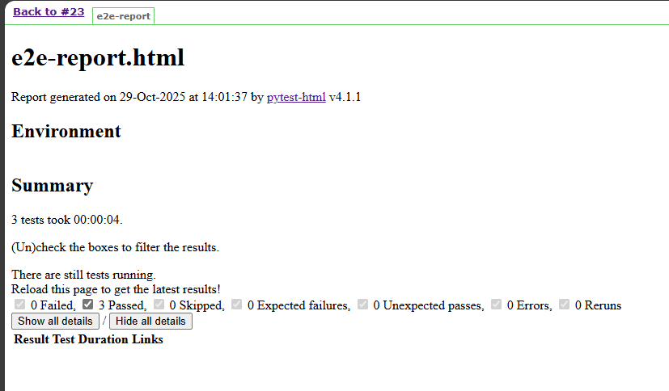

#### 5.3.1 User Flow Tests

**Archivo**: `tests/e2e/test_user_flow.py`

**Test: Complete User Registration Flow**

Este test simula el journey completo de un nuevo usuario.

Este test valida:

- La API de creación funciona correctamente
- Los datos persisten en la base de datos
- Las actualizaciones se aplican correctamente
- El ciclo completo CRUD funciona end-to-end

**Test: User Favorite Products Flow**

Valida la interacción entre User Service, Product Service y Favourite Service:

1. Crear usuario
2. Obtener lista de productos disponibles
3. Agregar producto a favoritos del usuario
4. Verificar que el favorito se creó correctamente
5. Consultar favoritos del usuario

#### 5.3.2 E2E Tests Implementados

**Archivo**: `tests/e2e/test_user_flow.py`

**Tests Implementados**:

1. **test_complete_user_registration_flow**: Flujo completo de registro y actualización de usuario
2. **test_user_authentication_flow**: Flujo de autenticación y autorización
3. **test_user_favorite_products_flow**: Flujo de agregar productos a favoritos

Estos tests validan la interacción entre múltiples servicios:

- User Service (gestión de usuarios)
- Product Service (catálogo de productos)
- Favourite Service (sistema de favoritos)

**Total E2E Tests**: 3 pruebas que validan flujos críticos de negocio ✅

### 5.4 Pruebas de Performance (Locust)

Las pruebas de performance simulan carga realista en el sistema para identificar cuellos de botella y validar que los SLAs se cumplan.

#### 5.4.1 Configuración de Locust

**Archivo**: `tests/performance/locustfile.py`

Locust define "usuarios" que ejecutan tareas con diferentes pesos, simulando patrones reales de uso:

```python
class EcommerceUser(HttpUser):
    wait_time = between(1, 3)  # Pausa entre requests
  
    @task(5)  # Peso: 5 (más frecuente)
    def view_products(self):
        """View product catalog"""
        self.client.get("/product-service/api/products")
  
    @task(3)  # Peso: 3
    def view_product_details(self):
        """View specific product"""
        if self.product_ids:
            product_id = random.choice(self.product_ids)
            self.client.get(f"/product-service/api/products/{product_id}")
  
    @task(2)  # Peso: 2
    def view_categories(self):
        """View product categories"""
        self.client.get("/product-service/api/categories")
  
    @task(2)  # Peso: 2
    def create_user(self):
        """Register new user"""
        user_data = {...}
        self.client.post("/user-service/api/users", json=user_data)
  
    @task(2)  # Peso: 2
    def view_users(self):
        """View all users"""
        self.client.get("/user-service/api/users")
  
    @task(1)  # Peso: 1 (menos frecuente)
    def view_favourites(self):
        """View all favourites"""
        self.client.get("/favourite-service/api/favourites")
  
    @task(1)  # Peso: 1
    def add_to_favourites(self):
        """Add product to favourites"""
        self.client.post("/favourite-service/api/favourites", json=fav_data)
```

Esta distribución de pesos simula un patrón realista:

- Muchos usuarios navegan productos y categorías
- Algunos crean cuentas y consultan usuarios
- Algunos agregan productos a favoritos

#### 5.4.2 Escenarios de Carga

**Staging (Validación)**:

- 50 usuarios concurrentes
- 10 usuarios/segundo spawn rate
- 60 segundos de duración
- Objetivo: Validar funcionamiento básico

**Pre-Production (Stress)**:

- 100 usuarios concurrentes
- 20 usuarios/segundo spawn rate
- 120 segundos de duración
- Objetivo: Simular carga de producción

#### 5.4.3 Métricas Recolectadas

Locust genera datos comprehensivos sobre el performance del sistema:

**Response Times**:

- Promedio, Mínimo y máximo, Percentiles (50%, 75%, 95%, 99%)

**Throughput**:

- Requests totales, Requests por segundo (RPS), Distribución por endpoint

**Errores**:

- Número de requests fallidos, Tipos de error (timeout, 4xx, 5xx), Distribución temporal de errores

**Gráficos Generados**:

- Response time over time, Number of users over time, RPS over time, Failures over time, Response time distribution (histogram)

Estos datos permiten identificar:

- Degradación de performance bajo carga
- Timeouts y resource exhaustion
- Endpoints problemáticos que requieren optimización

---

## 6. ANÁLISIS DE RESULTADOS Y MÉTRICAS

Esta sección presenta los resultados obtenidos de la ejecución de los pipelines y las pruebas implementadas, junto con el análisis de las métricas de performance y calidad.

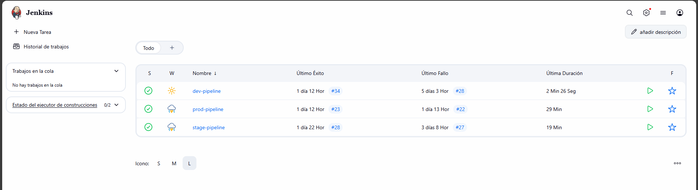

### 6.1 Resultados de Tests Unitarios

Los tests unitarios proporcionan feedback inmediato sobre la corrección de la lógica de negocio.

**Métricas Generales**:

- Total de tests ejecutados: 29
- Tests exitosos: 29 (100%)
- Tests fallidos: 0
- Duración total: ~33 segundos

**Análisis**:
Los tests unitarios mantienen una tasa de éxito del 100%, lo cual es esperado ya que prueban lógica aislada sin dependencias externas. La duración reducida (< 5 segundos por servicio) permite ejecuciones frecuentes.

### 6.2 Resultados de Tests de Integración

Las pruebas de integración validan la comunicación real entre servicios desplegados en Kubernetes.

**Métricas Generales**:

- Total de tests ejecutados: 20
- Tests exitosos: 20
- Tests fallidos: 0
- Duración total: 13 segundos

**Observaciones**:
Los tests de integración tienen mayor variabilidad que los unitarios debido a factores externos:

- Latencia de red entre servicios
- Tiempo de respuesta de bases de datos
- Estado de los servicios (warm vs cold start)
- Condiciones de eventual consistency

### 6.3 Resultados de Tests End-to-End

Los tests E2E validan flujos completos de usuario y son los más sensibles a problemas de configuración o infraestructura.

**Métricas Generales**:

- Total de flujos ejecutados: 3
- Flujos exitosos: 3
- Duración total: 4 segundos
- Flujos validados: 3 (user management, authentication, favorites)

**Análisis de Flujos**:

**User Flow**:

- Registro de usuario
- Actualización de perfil
- Gestión de favoritos

**Authentication Flow**:

- Creación de usuario con credenciales
- Verificación de acceso a recursos

**Favorite Flow**:

- Búsqueda de productos
- Agregado a favoritos
- Consulta de favoritos

### 6.4 Análisis de Performance

Las pruebas de performance con Locust proporcionan insights críticos sobre el comportamiento del sistema bajo carga.

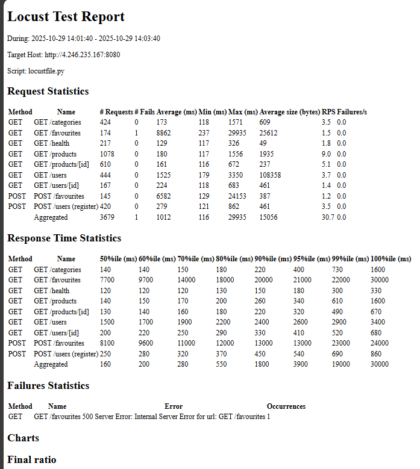

---

### 6.4.1 Resultados de Response Time

#### Endpoints GET (Lectura)

| Endpoint                     |        Avg (ms) | Min (ms) |         Max (ms) |         P95 (ms) |         P99 (ms) |
| ---------------------------- | --------------: | -------: | ---------------: | ---------------: | ---------------: |
| **GET /categories**    |             173 |      118 |            1,571 |              400 |              730 |
| **GET /favourites**    | **8,862** |      237 | **29,935** | **21,000** | **22,000** |
| **GET /health**        |             129 |      117 |              326 |              180 |              300 |
| **GET /products**      |             180 |      117 |            1,556 |              340 |              610 |
| **GET /products/[id]** |             161 |      116 |              672 |              320 |              490 |
| **GET /users**         | **1,525** |      179 |            3,350 |  **2,600** |  **2,900** |
| **GET /users/[id]**    |             224 |      118 |              683 |              410 |              520 |

#### Endpoints POST (Escritura)

| Endpoint                         |        Avg (ms) | Min (ms) |         Max (ms) |         P95 (ms) |         P99 (ms) |
| -------------------------------- | --------------: | -------: | ---------------: | ---------------: | ---------------: |
| **POST /favourites**       | **6,582** |      129 | **24,153** | **13,000** | **23,000** |
| **POST /users (register)** |             279 |      121 |              862 |              540 |              690 |

#### Percentiles agregados (toda la prueba)

* **P50:** 160 ms
* **P80:** 550 ms
* **P95:** **3,900 ms**
* **P99:** **19,000 ms**
* **P100 (máximo):** **30,000 ms**

**Lectura clave:** aunque la mayoría de endpoints de lectura típicamente responden <400 ms en P95, la cola pesada (P95/P99 agregados muy altos) está dominada por **/favourites** (GET/POST) y **/users** (GET).

---

### 6.4.2 Throughput y Capacidad

* **Total de requests:** **3,679**
* **Fallos:** **1** (tasa ≈ **0.027%**)
* **RPS promedio (Aggregated):** **30.7**
* **RPS por endpoint (promedio durante la ventana):**

  * /products: **9.0** RPS
  * /products/[id]: **5.1** RPS
  * /categories: **3.5** RPS
  * /users (GET): **3.7** RPS
  * /users (register): **3.5** RPS
  * /health: **1.8** RPS
  * /favourites (GET): **1.5** RPS
  * /users/[id]: **1.4** RPS
  * /favourites (POST): **1.2** RPS

---

### 6.4.3 Cuellos de Botella Identificados

A partir de las métricas del reporte:

1. **Latencia extrema en “favourites” (GET/POST).**

   * P95 **21–13 s** y P99 **22–23 s**, con máximos de **24–30 s**.
   * Probables causas: consultas costosas sin índices, *N+1 queries*, ausencia de *caching*, o dependencias externas lentas.
   * **Acciones recomendadas:**

     * Indexar columnas de filtrado/join; revisar plan de ejecución.
     * Implementar **caching** de lecturas frecuentes (e.g., Redis) y *write-behind* / colas para escrituras si aplica.
     * Limitar y **paginar** respuestas; evitar cargas masivas.
2. **GET /users con payload muy grande.**

   * **Avg size:** **108,358 bytes**, P95 ~2.6 s, P99 ~2.9 s.
   * **Acciones:** proyectar sólo campos necesarios (*field selection*), habilitar **compresión HTTP**, **paginar** y/o usar endpoints específicos por necesidad (avoid “list all”).
3. **Diseño de payload en /favourites.**

   * **Avg size GET:** **25,612 bytes** (alto).
   * **Acciones:** revisar esquema de respuesta (remover campos derivados, mover enriquecimientos a endpoints específicos, usar *expand* opcional).
4. **Cola pesada agregada.**

   * P95 global **3.9 s** y P99 **19 s** indican una distribución de latencias con **outliers severos** dominados por los dos puntos anteriores.
   * **Acciones:** establecer **SLOs por endpoint** y *alerting* por percentiles; pruebas de carga focalizadas y *profiling*.


