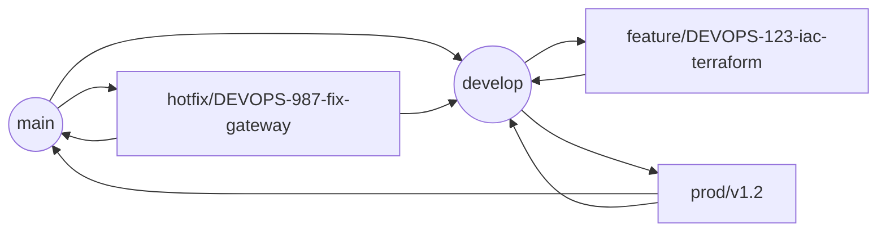

# Estrategia de Branching

Este repositorio adopta **GitFlow con ramas de release versionadas**, lo que permite iterar rápido en `develop`, integrar trabajo paralelo mediante ramas `feature/*` y publicar paquetes estables desde `main` siguiendo versionado semántico (SemVer). El pipeline `Jenkinsfile.prod` usa esta convención para empaquetar, etiquetar y desplegar.

## Diagrama del flujo

## Convenciones de nomenclatura

| Tipo de rama   | Formato                              | Cuándo se crea                                                                       |
| -------------- | ------------------------------------ | ------------------------------------------------------------------------------------- |
| Feature / Task | `feature/<ticket>-<resumen-corto>` | Cada historia o spike (`feature/DEVOPS-145-ci-sonar`).                              |
| Bugfix         | `bugfix/<ticket>-<resumen>`        | Correcciones detectadas en `develop`.                                               |
| Prod           | `prod/v<MAJOR.MINOR>`              | Cuando se congela un incremento para preparar staging/producción (`release/v1.3`). |
| Hotfix         | `hotfix/<ticket>-<impacto>`        | Urgencias en producción; parte de `main`.                                          |
| Support        | `support/<version>`                | Opcional para mantener ramas antiguas si un entorno legado necesita parches.          |

Reglas adicionales:

- El identificador debe corresponder al ticket de Jira (p. ej. `DEVOPS-210`).
- Usar minúsculas y guiones para mejorar la lectura.
- No mezclar múltiples tickets en la misma rama.

## Flujo operativo

### Features / bugfix

1. Actualizar `develop`.
2. Crear `feature/<ticket>-<resumen>`.
3. Commits pequeños con mensajes `[DEVOPS-123] <detalle>`.
4. Abrir PR contra `develop` usando `docs/pull-request-template.md`.
5. Tras aprobar y pasar pipelines, fusionar con squash o merge commit estándar (mantener historial limpio).

### Releases

1. Cuando el sprint cumple DoD, crear `release/vX.Y` desde `develop`.
2. Solo aceptar correcciones críticas vía PR hacia la rama release.
3. Ejecutar pipelines de staging desde esa rama.
4. Una vez validado, fusionar en `main` (crea el release) y hacer merge back a `develop`.

### Hotfix

1. Ramificar desde `main`: `hotfix/DEVOPS-999-failed-healthcheck`.
2. Ejecutar pruebas rápidas, abrir PR contra `main`.
3. Tras el merge, etiquetar inmediatamente (ver política de versiones) y fusionar la rama hotfix en `develop` para mantener paridad.

## Requisitos de Pull Request

| Chequeo                       | Detalle                                                                              |
| ----------------------------- | ------------------------------------------------------------------------------------ |
| **Revisores**           | Mínimo 2 (DevOps + QA/arquitectura).                                                |
| **Estado del pipeline** | Jenkins dev/stage verdes (unitarias, integración).                                  |
| **Static analysis**     | SonarQube sin vulnerabilidades ni code smells críticos.                             |
| **Security**            | Trivy sin vulnerabilidades High/Critical nuevas.                                     |
| **Artefactos**          | Evidencia de pruebas adjunta (reportes HTML, capturas).                              |
| **Checklist**           | Completar casillas del template (DoR cumplido, docs actualizadas, enlaces a ticket). |

Los PR hacia `main` y `release/*` requieren aprobación del Release Manager además del equipo técnico.

## Política de versionado y etiquetas

- SemVer: `MAJOR.MINOR.PATCH`.
  - `MAJOR`: cambios incompatibles (nuevas APIs públicas).
  - `MINOR`: nuevas capacidades compatibles.
  - `PATCH`: correcciones y hotfixes.
- `Jenkinsfile.prod` calcula `RELEASE_VERSION = BASE_RELEASE_VERSION.BUILD_NUMBER` y crea la etiqueta `v<RELEASE_VERSION>` durante el stage **Generate Release Notes** usando `commonFunctions.generateAndPublishRelease`.
- Cada merge a `main` desde `release/*` o `hotfix/*` debe disparar el pipeline de producción para generar la etiqueta y subir release notes.
- Si se necesita un tag manual (emergencia), usar `git tag -a v<semver> -m "Notas"` y `git push origin v<semver>`, pero registrar el motivo en `docs/agile/sprint-logs/`.

## Plantilla de PR y automatización

- Completar `docs/pull-request-template.md` (GitHub también mostrará la versión automática en `.github/pull_request_template.md`).
- Checkboxes obligatorias: historia enlazada, pruebas ejecutadas, pipelines verdes, documentación actualizada, tareas pendientes anotadas.
- Los pipelines deben validar el nombre de la rama y bloquear merges si no sigue el patrón (pendiente de hook).

## Referencias

- Manual ágil: `docs/agile/README.md`.
- Plantilla de PR: `docs/pull-request-template.md`.
